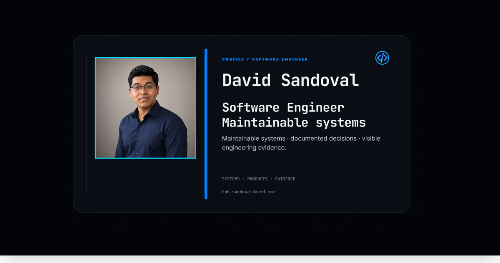

# David Sandoval — Professional Hub

I built this compact, bilingual professional Hub as a focused entry point to my work as a Software Engineer. It helps recruiters, collaborators and potential clients understand what I do and reach the right public destination quickly, without duplicating the depth of my portfolio, résumé or project repositories.

[View production](https://hub.sandovaldavid.com) · [Portfolio](https://sandovaldavid.com) · [Résumé](https://sandovaldavid.com/resume/david-sandoval-resume.pdf)

[](https://hub.sandovaldavid.com)

## Why I built this

I intentionally keep the Hub small. Its job is recognition and routing:

- establish who I am and what I do;
- surface a small set of relevant professional destinations;
- preserve factual parity between English and Spanish;
- provide a fast, accessible experience across mobile and desktop;
- keep public metadata, structured data and social previews aligned with the visible content.

I do **not** treat it as a second portfolio, a generic link-in-bio template or an independent brand. My name, work and professional evidence remain primary; the visual system supports that identity rather than replacing it.

## What I wanted this project to demonstrate

Beyond serving as my professional Hub, I use this repository as public evidence of how I approach a small production web application:

- Static generation with Astro for two localized routes: `/` and `/es/`.
- Typed content, destination and metadata ownership instead of scattering copy and URLs through components.
- A shared Light, Dark and System theme implementation derived from the same semantic token system.
- Responsive and keyboard-first interaction patterns, including reduced-motion and high-contrast behavior.
- SEO and social metadata assembled from the same public identity sources as the rendered page.
- `ProfilePage` structured data around one canonical `Person`.
- Automated quality checks for architecture, formatting, linting, links, unit tests, browser behavior, accessibility and Lighthouse.
- Versioned GitHub ruleset intent, Dependabot maintenance and automated release preparation.

## Why Astro

I chose Astro because this product has two content-focused routes and a deliberately small client-side interaction boundary. Most of the experience can be delivered as static HTML, so I avoid introducing framework hydration where the product does not need it.

The browser JavaScript is limited to behavior that genuinely requires it, including theme management, sharing, navigation analytics and the scroll-to-top control.

## Stack

| Area | Technology |
| --- | --- |
| Framework | Astro 7 |
| Language | TypeScript |
| Styling | Tailwind CSS 4 + project CSS tokens |
| Package manager | Bun 1.3.14 |
| Browser testing | Playwright |
| Accessibility | Axe + manual accessibility checks |
| Performance | Lighthouse CI |
| Analytics | Vercel Analytics + privacy-safe navigation events |
| Deployment | Vercel |
| Release automation | release-please |

## Source structure

```text
src/
├── app/       # layout, global styles and page-level models
├── data/      # typed content, URLs, SEO and structured data
├── entities/  # reusable product concepts
├── features/  # interactive user actions
├── pages/     # English and Spanish route composition
├── shared/    # reusable UI, assets, utilities, i18n and analytics
└── widgets/   # composed page sections
```

The structure is deliberately shallow. The project borrows useful separation ideas from feature-oriented architectures without imposing ceremony that the application does not need.

See [`docs/architecture.md`](docs/architecture.md) for placement rules, dependency direction and runtime ownership.

## Run locally

### Prerequisites

- Bun `1.3.14`;
- Node.js `22.19` or newer only when running the native Lighthouse toolchain.

```bash
git clone https://github.com/sandovaldavid/hub.git
cd hub
bun install --frozen-lockfile
bun run dev
```

Open `http://localhost:4321`.

Basic development does not require private credentials. [`.env.example`](.env.example) documents the optional public Facebook App ID metadata field.

For a reproducible Linux browser environment, especially for Playwright and Lighthouse, use the repository DevContainer. Detailed setup and recovery instructions live in [`docs/operations.md`](docs/operations.md).

## Validation

For a fast repository-quality gate:

```bash
bun run validate:quality
```

For the complete local gate used before release-oriented changes:

```bash
bun run validate:local
```

The complete gate covers type checking, architecture rules, formatting, linting, link health, unit tests, production build, Playwright browser coverage, Axe checks and Lighthouse mobile/desktop audits.

The accessibility implementation targets WCAG 2.1 AA practices and is regression-tested with automated and manual checks; this repository does **not** claim formal accessibility certification.

### Useful commands

| Command | Purpose |
| --- | --- |
| `bun run dev` | Start Astro on port `4321` |
| `bun run build` | Validate architecture and build the static site |
| `bun run check:architecture` | Detect circular dependencies and forbidden barrels |
| `bun run check:links` | Validate repository and public destinations |
| `bun run format:check` | Verify Prettier formatting |
| `bun run lint` | Run ESLint |
| `bun run test:unit` | Run unit and repository-contract tests |
| `bun run test:e2e` | Run Playwright functional, SEO and accessibility coverage |
| `bun run test:lighthouse` | Run mobile and desktop Lighthouse profiles |
| `bun run validate:quality` | Run the fast quality gate |
| `bun run validate:local` | Run the complete local validation gate |

## Development and delivery

The repository uses `develop` as the integration branch and `main` as the stable production branch:

```text
feature/*, fix/*, refactor/*, docs/* -> develop -> main
```

External contributors should branch from `develop` and open pull requests back to `develop`. Production deployment is associated with `main`.

See [`CONTRIBUTING.md`](CONTRIBUTING.md) for contribution scope and validation expectations.

## Documentation

Start with [`docs/README.md`](docs/README.md) for the contributor-facing documentation map.

Key documents:

- [`docs/architecture.md`](docs/architecture.md) — source boundaries, dependency direction and runtime ownership;
- [`docs/operations.md`](docs/operations.md) — setup, validation, CI, delivery and maintenance;
- [`docs/accessibility/manual-checklist.md`](docs/accessibility/manual-checklist.md) — manual accessibility and release checks;
- [`CONTRIBUTING.md`](CONTRIBUTING.md) — contribution workflow and project constraints;
- [`SECURITY.md`](SECURITY.md) — private vulnerability reporting;
- [`AGENTS.md`](AGENTS.md) — repository-specific guidance for coding agents and maintainer automation.

I keep the public repository self-contained: a developer should be able to understand, build and test it without access to my private strategy, notes or planning systems.

## Contributing

I welcome bug reports, accessibility findings, documentation improvements and focused maintainability fixes. Because this is a personal professional surface with intentionally narrow scope, please open an issue before starting a substantial feature or product-direction change.

## Security

Please do not disclose vulnerabilities, credentials or personal data in a public issue. Follow [`SECURITY.md`](SECURITY.md) for private reporting.

## License

I keep this repository public for transparency and technical review, but it currently does **not** include an open-source `LICENSE` file. No license is granted here for reuse, modification or redistribution of the source code or visual assets.
